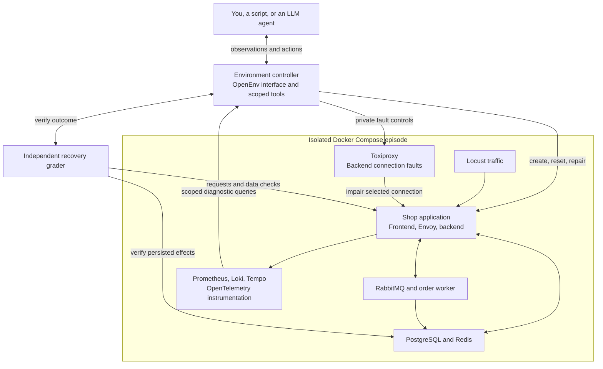
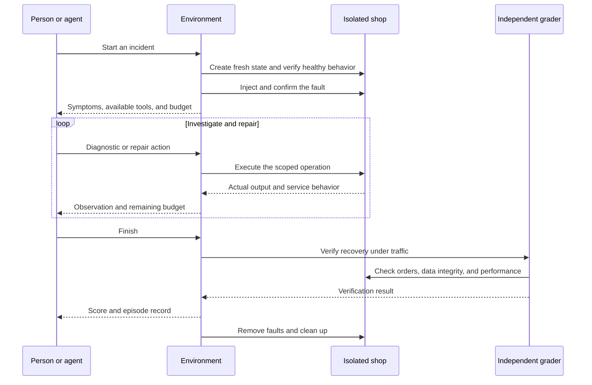

# mini-sregym

rl environment for agents to diagnose and resolve site reliability engineering (SRE) incidents in real services.

mini-sregym is designed around a small shop application with real services, traffic, and failures. Each attempt starts with an isolated environment and an incident to investigate. A person or an agent inspects the evidence, applies a repair, and receives a score based on whether the application actually recovered.

[Getting started](#getting-started) · [Architecture](#architecture) · [Example incident](#example-incident) · [Contributing](#contributing)

## Who is this for?

- **Developers learning RL** who want to understand observations, actions, rewards, and resets by building an environment.
- **Agent builders** who want to compare models, prompts, and investigation strategies against measurable outcomes.
- **Engineers exploring reliability** who want to investigate cache, queue, configuration, and network failures in a local application.

The focus is a small system you can understand end to end: how a fault changes its behavior, what evidence an agent sees, and how to verify a repair. All application data is synthetic.

## Getting started

#### TBU

The intended workflow is:

1. **Start the lab.** Launch the environment controller and let it provision an isolated application for each attempt.
2. **Choose an incident and a client.** Work through it manually, use a scripted repair, or connect an LLM agent through OpenEnv. A Verifiers integration is planned for automated evaluations.
3. **Investigate and repair.** Query logs, metrics, and traces; inspect configuration; apply permitted changes.
4. **Review the result.** Inspect the recovery score, action history, timing, and verification outcome. Reset to try again from fresh state.

Model-provider credentials will only be needed for LLM-driven attempts. Manual and scripted attempts are intended to work without model calls. Model training is outside this project's scope.

## Architecture

The controller manages each episode's lifecycle, tools, and scoring. Docker Compose runs the application and its supporting services.

The diagram groups services by responsibility. API traffic follows **frontend → Envoy → Toxiproxy → backend**. Envoy selects the backend route; Toxiproxy introduces faults on that connection. The backend uses PostgreSQL and Redis, and publishes order work through RabbitMQ.

Each attempt gets its own containers, networks, volumes, and telemetry. The agent uses bounded tools to inspect and repair the application. Fault controls and grading stay with the controller.

### Execution flow

The environment also ends an attempt when its action or time budget expires. A valid attempt earns **1 for verified recovery with its required checks passing, or 0 otherwise**. Setup and grading failures are reported separately. A successful tool call or a claim that the incident is fixed does not determine the score.

## Example incident

**Checkout requests are timing out, but the database appears healthy.**

In the planned network-failover exercise, Toxiproxy impairs the connection to the primary backend. The agent can use metrics and traces to locate the delay, inspect the available routes, and switch Envoy to a healthy standby.

The fault remains active while the grader sends new requests. Orders must reach the worker, complete successfully, and preserve existing data without duplicate processing effects. An API response saying an order was accepted is only the start of that check.

The resulting episode record shows the evidence gathered, the actions taken, and whether the repair worked.

## Incidents to explore

The planned curriculum covers 13 incident families, introduced and validated incrementally.

| Area | Example failures | What you investigate |
| --- | --- | --- |
| Configuration | Wrong upstream address, missing settings, maintenance mode | Effective configuration and service startup |
| Database | Incorrect credentials or database target | Authentication, expected data, and persisted writes |
| Cache | Stale catalog entries | Cache consistency and scoped invalidation |
| Messaging | Publisher authentication failure, worker on the wrong queue | Backlog, retries, and eventual order completion |
| Routing and network | Incorrect proxy route, delayed or failed primary connection | Dependency localization and failover |
| Performance | Undersized connection pool, overly short timeout | Queueing, deadlines, and behavior under load |

Every released incident must fail without repair and have a verified solution using the same tools available to the agent.

## Where RL fits

An environment defines the **task, observations, actions, transitions, reward, and episode boundaries**. mini-sregym makes these concrete: a task is an incident, observations come from real services, actions change the application, and reward comes from independent recovery checks.

You can use this loop to evaluate a fixed LLM or improve its prompt and tools without changing model weights. A separate RL training system could later collect compatible trajectories and use rewards to update a trainable model. Repeating attempts alone does not train the model; mini-sregym focuses on environment execution, evaluation, and recording those attempts.

## Planned stack

| Component | Technology |
| --- | --- |
| Local runtime | Docker Compose |
| Application data and cache | PostgreSQL, Redis |
| Asynchronous orders | RabbitMQ and a dedicated worker |
| Routing and network faults | Envoy, Toxiproxy |
| Workload generation | Locust |
| Metrics, logs, and traces | Prometheus, Loki, OpenTelemetry, Tempo |
| Agent interface and evaluation | OpenEnv, with a planned Verifiers adapter |

Grafana and Sentry are optional additions. Kubernetes and Chaos Mesh are reserved for a later learning extension.

## Contributing

Questions, unclear explanations, and incident ideas are welcome in [GitHub Issues](https://github.com/AbhishekRP2002/mini-sregym/issues). For an incident proposal, describe the visible symptom, the failure mechanism, a permitted repair, and how recovery could be checked independently.

The immediate implementation focus is one complete incident with a clean reset, real diagnostics, a scripted repair, and a trustworthy grader.

## Inspiration and related projects

mini-sregym draws on SRE benchmarks, RL environments, and agent evaluation frameworks:

- [SREGym](https://github.com/SREGym/SREGym) — real service incidents, controlled fault injection, and separate diagnosis and recovery evaluation.
- [ITBench](https://github.com/itbench-hub/ITBench) — realistic IT incident scenarios, reusable fault definitions, and explicit setup and teardown workflows.
- [AIOpsLab](https://github.com/microsoft/AIOpsLab) — orchestration of workloads, faults, telemetry, and agent actions, with distinct incident detection, diagnosis, and mitigation tasks.
- [AutomationBench](https://github.com/zapier/AutomationBench) — fresh state for each attempt, explicit task contracts, and checks that make evaluation outcomes trustworthy.
- [Harbor](https://github.com/harbor-framework/harbor) — separation of task instructions, execution environments, reference solutions, and independent verification.
- [OpenEnv](https://github.com/huggingface/OpenEnv) — typed environment interactions through reset, step, observations, and rewards; our planned public interface.
- [Verifiers](https://github.com/PrimeIntellect-ai/verifiers) — reusable tasksets, agent rollouts, and evaluation integration; our planned agent-side adapter.
